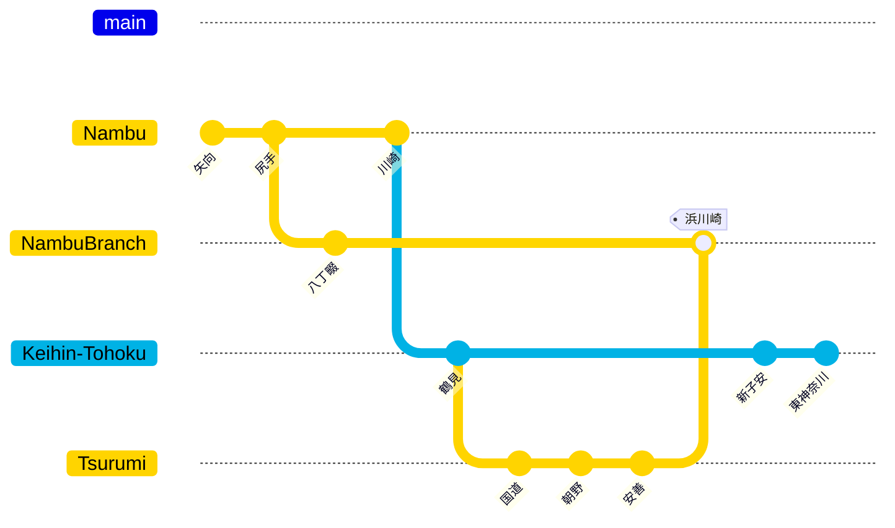

```mermaid
%%{init: { 
 'themeVariables': {
        'git1': '#ffd600', 
        'git2': '#ffd600', 
        'git3': '#00b2e5',
        'git4': '#ffd400',
        'gitBranchLabel1': '#000000',
        'gitBranchLabel2': '#000000',
        'gitBranchLabel3': '#000000',
        'gitBranchLabel4': '#000000'
    }
} }%%
gitGraph
       branch Nambu
       commit id: "矢向"
       commit id: "尻手"
       branch NambuBranch
       commit id: "八丁畷"
       checkout Nambu
       commit id: "川崎"
       branch Keihin-Tohoku
       commit id: "鶴見"
       branch Tsurumi
       checkout Tsurumi
       commit id: "国道"
       commit id: "朝野"
       commit id: "安善"
       checkout NambuBranch
       merge Tsurumi tag: "浜川崎"
       checkout Keihin-Tohoku
       commit id: "新子安"
       commit id: "東神奈川"
```
