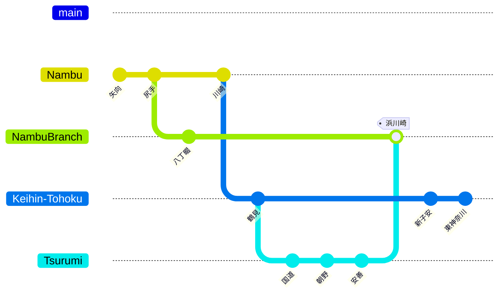

```mermaid
 gitGraph
       branch Nambu
       commit id: "矢向"
       commit id: "尻手"
       branch NambuBranch
       commit id: "八丁畷"
       checkout Nambu
       commit id: "川崎"
       branch Keihin-Tohoku
       commit id: "鶴見"
       branch Tsurumi
       checkout Tsurumi
       commit id: "国道"
       commit id: "朝野"
       commit id: "安善"
       checkout NambuBranch
       merge Tsurumi tag: "浜川崎"
       checkout Keihin-Tohoku
       commit id: "新子安"
       commit id: "東神奈川"
```
