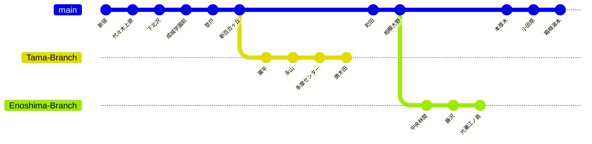

```mermaid
gitGraph
    checkout main
    commit id:"新宿"
    commit id:"代々木上原"
    commit id:"下北沢"
    commit id:"成城学園前"
    commit id:"登戸"
    commit id:"新百合ヶ丘"
    branch Tama-Branch
    commit id:"栗平"
    commit id:"永山"
    commit id:"多摩センター"
    commit id:"唐木田"
    checkout main
    commit id:"町田"
    commit id:"相模大野"
    branch Enoshima-Branch
    commit id:"中央林間"
    commit id:"藤沢"
    commit id:"片瀬江ノ島"
    checkout main
    commit id:"本厚木"
    commit id:"小田原"
    commit id:"箱根湯本"
```
